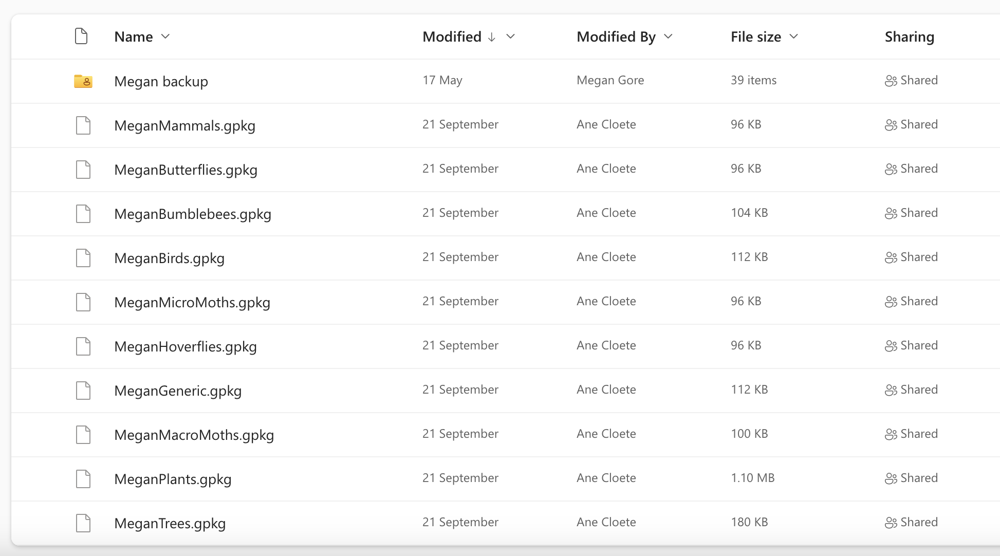
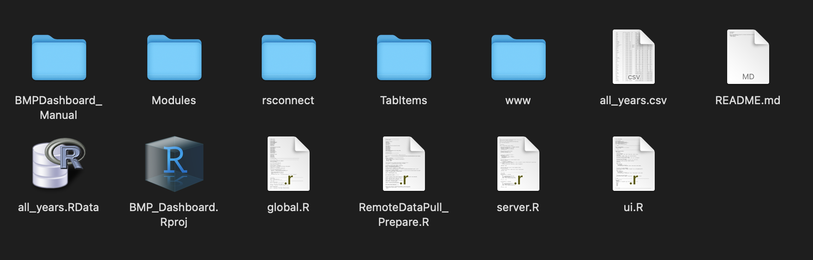

# Files within folders and folders within files and more files

Let's go over all the files and folders you've now gotten access to starting with the OneDrive Folder. 

## Biodiversity KPI mapping Master

This is, as it's name suggests, the master folder! And all the NB things are stored here, this is what you should see (unless more folders have been added since the creation of this bookdown 😅). But don't fret, you probably know about these folders already and the most important folders for the dashboard are: **Team_Data**, **Survey_Photos** and **Biodiversity Survey Master**. 

### Biodiversity Survey Master

Here is where all the students upload their biodiversity data. Each student has their own folder labelled with their names and within each folder all the geopackages for each taxa they have collected data on is stored (plus another folder containing backups), e.g. 

If you don't know what a [geopackage](https://www.geopackage.org/) is, here's a quick description:

A GeoPackage is like a supercharged file for maps and location data. It's a clever way to bundle up all sorts of info—like where things are on a map, pictures, and details about those things. Think of it as a digital suitcase for geography. What makes it cool is that it works on different devices and software without any fuss. 

### Team_Data

This folder contains photos of each student and a word document containing their "About Me" descriptions used in the dashboard. The nomenclature and file type is important here. The photo mus"t be saved with their name as the file name and they should be jpg's! Then the word document should be called "student_aboutme" - you can change it if you want, but then you have to change it in the dashboard code as well. Within the document the student descriptions are paragraphs and within the first sentence the student introduces themselves with their names - this is NB. The code will will separate the text into paragraphs and then filter for the student by searching for their name. It's your job to tell everyone to stick to this format and style! 

### Survey_Photos 

All the photos taken while surveying are uploaded here with their unique photo ID as file name. The file name isn't super important for the dashboard as long as it's consisted between their records and the uploaded data. Ensure that all the photos are in the same format (i.e. jpg) - if not then there is a way to convert them all in one go which I'll mention later. 

## BMPDashboard 

Here is what you should see: 

- BMPDashboard_Manual folder
 
- BMP_Dashboard.Rproj

- RemoteDataPullPrepare.R

- global.R

- server.R

- ui.R

- Modules folder

- rsconnect folder (you'll only see this once you've published the app to shinyapps.io)

- TabItems folder 

- www folder 

- README.md

- packages.R
 

If you're familiar with R projects and shiny apps then this should look familiar barring the obvious extras such the as the first folder (which contains the code for this bookdown). Let's quickly go over the rest. 

### RemoteDataPullPrepare.R

This contains the code for pulling the data from OneDrive and preparing it. 

### global.R, ui.R and server.R 

These are the main shiny app files! 

### TabItems 

Contains the ui code for each tab in the dashboard (Tab_About.R, Tab_KPI.R, Tab_Record_Finder.R, Tab_Student_Engagement.R and Tab_Taxa_Explorer.R). I've done this mostly to keep the ui file clean and comprehensible, but it's slightly annoying for work flow as when you make a change here, you have close the app and then run it again. You could put all the code into the ui script and then if you make changes you only have to reload the app. Up to you! 

### Modules 

Contains the code for a custom valuebox which is used throughout the dashboard which I've turned into a shiny module. A Shiny module is like a neat toolkit for creating specific interactive parts of your app without making a mess of your code. It's like having a mini-app inside your bigger app. So, let's say you want a snazzy chart or a dynamic table—you can build that as a Shiny module. It keeps things organized and clean, making your web development life easier. It's like having building blocks for your website, and each block (or module) does a special job, making your site more interactive and user-friendly.

At the moment I've only converted the valuebox into a module, but there are other things that can be turned into modules too! Like the datatables or the bar graphs. Feel free to play around with this! 

### www 

The **www** folder is like the storage room of your shiny app where you keep all the stuff that makes the outside look awesome. In the **www** folder, you put things like images, stylesheets (which control how things look), and JavaScript files (for extra functionality). In our **www** folder you'll find: 

- all the survey photos

- a custom css stylesheet (custom.css)

- a copy of the Team_Data folder with additional objects: doc_parts.RData and student_text_sep.RData

- the allyears.RData object (this is the cleaned dataset which the dashboard uses)

### README.md

This a plain text file usually written in a simple format called Markdown that contains the description you see on github. 

### packages.R

This r script contains all code to install and load all the packages required for the dashboard. 