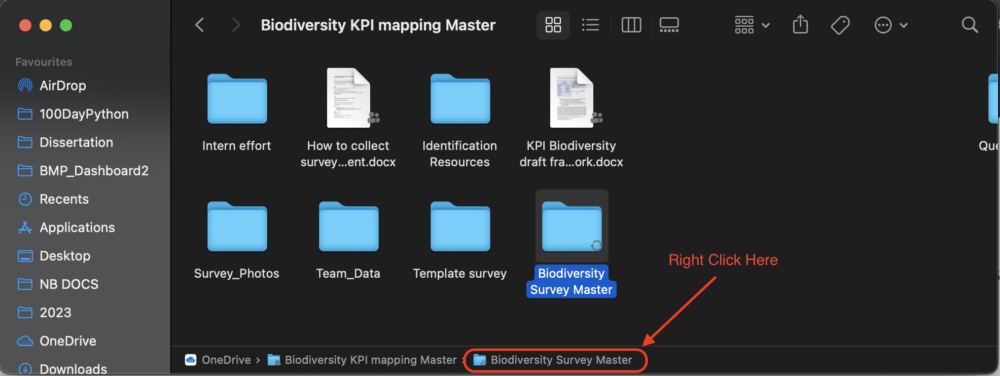

# The Data 

```{r, include = FALSE}

knitr::opts_chunk$set(eval=FALSE)

```

## Setting up OneDrive:

The following instructions are for Mac users. If you are using windows, you should have OneDrive already installed on your computer.

1. **Download OneDrive:**
   - Go to the Mac App Store on your laptop.
   - Search for "OneDrive."
   - Click on "Get" or "Install" to download the OneDrive app.

2. **Install OneDrive:**
   - Once downloaded, open your Applications folder and locate the OneDrive app.
   - Drag the OneDrive app to your Dock for easier access (optional).

3. **Sign In:**
   - Open the OneDrive app.
   - Sign in with your university account. 
   - Follow the on-screen prompts to set up OneDrive.

4. **Choose Folders to Sync:**
   - Once signed in, you'll have the option to choose which folders from your OneDrive cloud storage you want to sync with your Mac. 
   - Select the folders you want or choose to sync everything.

5. **Set OneDrive Preferences:**
   - Click on the OneDrive icon in the Mac menu bar at the top of your screen.
   - Click on the three dots (More) and select "Preferences."
   - Here, you can adjust settings like:
     - Starting OneDrive automatically when you sign in to your Mac.
     - Choosing how files are downloaded or uploaded (e.g., over metered networks).
     - Setting up file on-demand (allows you to see all your files without having them downloaded).

6. **Accessing Your Files:**
   - A OneDrive folder will now be present in your Mac's Finder. This folder will sync with your online OneDrive storage. <span style = "color: red; font-weight: bold"> Any files or folders you add to this folder will be automatically uploaded to the cloud, and any changes you make to files in this folder will be reflected in the cloud version.</span> Read that again! It important that you know that if you change or delete any files in the OneDrive folder on your laptop it will affect the database online. 

7. **To Unlink or Sign Out:**
   - If you ever wish to unlink your account or sign out, click on the OneDrive icon in the Mac menu bar.
   - Click on the three dots (More) and select "Preferences."
   - Go to the "Account" tab and select "Unlink this Mac."

### Windows: 


## Structure of the Biodiversity KPI Mapping Master

## Getting the data 

First, navigate to the R script called "packages" to check whether you have all the required packages, if you don't the script will also install and load them for you. Done!

Now navigate to the script "RemoteDataPull_Prepare", it contains all the code for pulling and cleaning the biodiversity data collected by the students. Each student will have their own folder within this folder. Within each of the student folders, there are various geopackages, one for each taxa they have surveyed. The naming of the geopackages are their initials or names followed by the particular taxa, e.g. Ericabutterflies.gpkg. 

The most important first step here is to modify the object "path_to_master" with the filepath to where ever you have the OneDrive folder on your device and specifically to the main survey folder "Biodiversity Survey Master". If you are using a Mac, navigate to the folder in Finder and then in the bottom panel (see below), right click the folder name and select "Copy "folder name" as Pathname". 



Let's break down the code:

1. **Setting the Path to the Master Directory**:

```{r}
   path_to_master <- "/Users/anecloete/Library/CloudStorage/OneDrive-UniversityofStAndrews/Biodiversity KPI mapping Master/Biodiversity Survey Master"
```

This line sets a variable called `path_to_master` to the path of the main directory where the geopackage files are located. Paste the pathname you copied here. 

2. **Obtaining All Geopackage Files**:

```{r}
   all_gpkgs <- list.files(
     path = paste(path_to_master),
     recursive = TRUE,
     pattern = "\\.gpkg$",
     full.names = TRUE
   )
```

This code lists all files with the ".gpkg" extension in the specified directory and its subdirectories. 
- The `path` argument specifies where to look.
- `recursive` set to `TRUE` means it will look in subdirectories as well.
- `pattern` filters for files ending with ".gpkg".
- `full.names` set to `TRUE` ensures the full path of each file is returned, not just its name.

3. **Filtering Geopackages with 'Habitat_Polygon' in Their Name**:

```{r}
   survey_polygons <- all_gpkgs[grepl("Habitat_Polygon", all_gpkgs)]
```

This filters the `all_gpkgs` vector for filenames that contain the substring "Habitat_Polygon" and assigns the subset to `survey_polygons`.

4. **Excluding Geopackages Based on Certain Keywords**:

```{r}
   pattern <- "Polygon|DESKTOP|PC|LAPTOP|Wills"
   all_gpkgs <- all_gpkgs[!grepl(pattern, all_gpkgs)]
```

Here, a pattern is defined to exclude geopackages with certain keywords in their names. The `grepl` function checks for matches, and the `!` operator negates the condition to exclude matches.

5. **Exclude a Specific Problematic Geopackage**:

```{r}
   problematic_gpkg <- paste0(path_to_master,"/Erica/Erica Backup/Ericabutterflies.gpkg")
   all_gpkgs <- all_gpkgs[all_gpkgs != problematic_gpkg]
```

This code defines a specific geopackage file path that is "problematic" and then removes this file from the `all_gpkgs` vector.

6. **Reading All Geopackages into a List**:

```{r}
myfiles <- lapply(all_gpkgs, st_read)
```

The `lapply` function is used here to apply the `st_read` function to each file path in the `all_gpkgs` vector. The result is a list, with each element being the content of a geopackage file stored as an spatial features dataframe. The `st_read` function is part of the `sf` package in R and is used to read spatial data.

In summary, this code:
- Sets a path to a master directory.
- Lists all geopackage files from this directory and its subdirectories.
- Filters and excludes certain geopackages based on keywords or specific filenames.
- Reads the content of each remaining geopackage file into a list.


## Data cleaning and preparation 

Most of this is self explanatory or is a bit tedious to explain. I would recommended investigating and exploring the data before the cleaning and preparation so that some of the lines make more sense. But here are a few notable things: 

- Each student have a backup folder embedded in their folder, these geopackages are removed in line 72
- There is separate geopackage for tree data collected, this is included in the dashboard so is cleaned separately and then joined to the rest. 
- The Species column contains the name of the species recorded, whether this is the scientific name, the common name or anything else. So all the naming columns are coalesced into one column called Species. 
- Line 135 was necessary because for some reason empty entries in the relevant columns were "" and not NA 

Some of the code could be a little less sausage making-ish and could be simplified (somethings were added after the fact etc), feel free to make it more efficient! 

**SUMMARY**:

1. **Coordinate Transformation**:
    - Transforms the coordinate reference system of spatial data to standard latitude and longitude (EPSG:4326).

```{r}

# Transform coordinate reference system from WGS 84 / Pseudo-Mercator to standard lat long (EPSG:4326)
taxa_dat <- lapply(myfiles, function(x) st_transform(x, 4326))

```


2. **Data Conversions**:
    - Converts the spatial data frames to regular data frames.
    - Names each data frame in the list based on the geopackage filename.
    - Removes duplicate data frames based on their names.

```{r}

# Convert spatial data frames to regular data frames
taxa_dat <- lapply(taxa_dat, as.data.frame)

# Name each data frame in the list based on the geopackage filename
names(taxa_dat) <- basename(all_gpkgs)

# Remove any duplicate data frames by name
taxa_dat <- taxa_dat[!duplicated(names(taxa_dat))]
```

3. **Tree Entries Package Preparation**:
    - Modifies columns for a specific geopackage ('Tree Species Entries.gpkg') to ensure compatibility with subsequent operations.
    - Cleans and modifies species names.
    - Sets certain columns to specific values or `NA`.
    - Filters and selects specific columns.

```{r}

# Modify certain columns for 'Tree Species Entries.gpkg' so that bind_rows works 
taxa_dat$`Tree Species Entries.gpkg` <- taxa_dat$`Tree Species Entries.gpkg` %>%
  rename(Species = 1, Date = 2) %>%
  mutate(
    Species = case_when(
      Species %in% c("unknown/other", "Unknown/other") ~ comments.unlisted.species,
      Species == "Unknown young pine " ~ "Unknown young pine",
      Species == "Willow x10" ~ "Willow",
      TRUE ~ Species
    ),
    taxa = "Vascular Plants",
    Observer = NA,
    photoid = NA,
    Count = NA,
    Other = NA,
    Speciesful = NA
  ) %>%
  filter(Species != "") %>%
  select(Species, Date, taxa, Count)
```


4. **Date Processing**:
    - Converts, splits, and extracts components (year, month, day) of the 'Date' column.
    
```{r}

# Date Processing: Convert, split and extract components of the 'Date' column
taxa_dat <- lapply(taxa_dat, function(df) {
  
  df$Date <- as.character(df$Date)
  
  df <- df %>%
    separate(Date, into = c("date", "time"), sep = " (?=[^ ]+$)") %>%
    mutate(
      date = ymd(gsub("/", "-", date)),
      year = year(date),
      month = month(date),
      day = day(date)
    )
  return(df)
})

```

5. **Tree Data Extraction**:
    - Removes the tree data frame from the list and stores it separately.
    
```{r}

# Extract and remove the tree dataframe from the list
tree_data <- taxa_dat$`Tree Species Entries.gpkg`
taxa_dat$`Tree Species Entries.gpkg` <- NULL


```

6. **Combining Data**:
    - Merges all data frames in the list into a single data frame.

```{r}

# Combine all data frames in the list into a single data frame
taxa_comb <- bind_rows(taxa_dat)

```

7. **Data Cleaning and Transformation**:
    - Performs several operations to clean and transform the combined data, including:
        - Date conversions and modifications.
        - Handling missing values.
        - Excluding certain records.
        - Recoding values in various columns.
        - Selecting and renaming columns.
```{r}

# Clean and transform taxa data for further analysis
taxa_clean <- taxa_comb %>%
  drop_na(taxa) %>%
  as.character(df$Date) %>% 
  separate(Date, into = c("date", "time"), sep = " (?=[^ ]+$)") %>%
  mutate(
    date = ymd(gsub("/", "-", date)),
    year = year(date),
    month = month(date),
    day = day(date)
  ) %>% 
  filter(!(taxa == "hoverfly" & Observer == "Erica")) %>% # remove Erica hoverfly entries 
  unite(collapsed_species, specieslatin:seaweedlatin, sep = ",", na.rm = TRUE) %>%
  mutate_at(vars(Species, collapsed_species), na_if, "") %>%
  mutate(
    Species = coalesce(Species, SpeciesSci, Speciesfull, collapsed_species, species, Other),
    photoid = if_else(is.na(photoid), NA, paste0(photoid, ".jpg")),
    Count = ifelse(is.na(Count), 1, Count),
    taxa = recode(taxa, tree = "Vascular Plants"),
    year = recode(year, `2023` = "2022/2023", `2022` = "2022/2023")
  ) %>%
  filter(!str_detect(Species, "(?i)unknown"), taxa != "bee") %>%
  filter_at(vars(taxa, Observer), all_vars(!is.na(.))) %>%
  mutate(
    taxa = recode(taxa, 
                  plant = "Vascular Plants",
                  bird = "Birds",
                  macromoth = "Macromoths",
                  micromoth = "Micromoths",
                  butterfly = "Butterflies",
                  dragonfly = "Dragonflies",
                  hoverfly = "Hoverflies",
                  bat = "Bats",
                  amphibian = "Amphibians",
                  reptileamphibian = "Amphibians",
                  bumblebee = "Bumblebee",
                  mammal = "Mammals",
                  ladybird = "Ladybirds",
                  tree = "Vascular Plants"),
    year = recode(year,
                  "2023" = "2022/2023",
                  "2022" = "2022/2023"),
    Observer = recode(Observer,
                      Other1 = "Cori")) %>%
  select(Species, SpeciesSci, Count, date, Observer, taxa, photoid, geometry, year, day) %>%
  rename(
    Date = date,
    Taxa = taxa,
    PhotoID = photoid
  )

```

8. **Merging Tree Data with Cleaned Data**:
    - Prepares the tree data to be merged with the cleaned data.
    - Merges both datasets.

```{r}
# tree data prep for bind
tree_data <- tree_data %>%
  mutate(
    year = ifelse(year == "2023" | year == "2022", "2022/2023", year),
    Count = 1 # add column count 
  ) %>%
  rename(
    Date = date,
    Taxa = taxa
  )

# Merge tree data with the cleaned data
all_years <- bind_rows(taxa_clean, tree_data)

```

9. **Geometry Processing**:
    - Splits the geometry column into separate latitude and longitude columns.

```{r}

# split into lat and long for mapping 
all_years <- all_years %>% mutate(long = unlist(map(geometry,1)),
           lat = unlist(map(geometry,2)))


```

10. **Saving the Resulting Data**:
    - Saves the final data frame both as an RData object and as a CSV file.

```{r}

# Save the resulting dataframe
save(all_years, file = "all_years.RData")
write.csv(all_years, file = "all_years.csv")

``` 

## Pulling photos and documents from OneDrive
### Photos
1. **Reading Team Photos from a Directory**:

```{r }
   # read in all photo files within Survey_Photos in OneDrive Folder
   all_Tphotos <- list.files(
     path =   paste0(path_to_master,"/Team_data"),
     recursive = TRUE,
     pattern = "\\.jpg$",
     full.names = FALSE
   )
```

This is the same as the first few lines of code, except that the path is constructed by appending "/Team_data" to the `path_to_master`.

The result is stored in `all_Tphotos`, which will be a vector of filenames (with ".jpg" extension) from the specified directory and its subdirectories.

2. **Constructing a Destination Path for Team Photos**:

```{r}
   www_Tfolder_path <- file.path(getwd(), "www/Team_Data")
```

This line constructs a path by combining the current working directory (obtained using `getwd()`) with "www/Team_Data". 

3. **Copying the Team Photos**:
```{r}
   photo_move <- file.copy(
     from = file.path(paste0(path_to_master,"/Team_data"), all_Tphotos),
     to = file.path(paste(www_Tfolder_path), all_Tphotos)
   )
```

Here, `file.copy` is used to copy files. The `from` argument constructs the full paths of the source files, and the `to` argument constructs the full paths of the destination. The photos are copied from the source directory to the destination.

The same process as above is then done for the Survey Photos. 

In summary, the code is designed to:

- Read all ".jpg" files from "Team_data" and "Survey_Photos" directories (including subdirectories).
- Copy those files to two new destinations under the "www" folder in the current working directory.


### Documents 

The code for downloading and saving the students' about me descriptions is very similar to the process above. The only addition is that the text of the "student_aboutme" word document is then extracted and saved into an object called "student_text". Then the text is split into paragraphs. 

## Things to think about

How will the next years data be included? In the same folder? New QGIS folder? 
