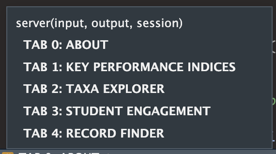

```{r, include = FALSE}

knitr::opts_chunk$set(eval=FALSE)

```

# Server

In the server.R file we define the server side of the shiny app. The code is neatly commented so that you can navigate to the server code for each of the tab panels:



Before that though, we do some NB things: 

## Setup 

**1. Fetching Data:**

Reactive expression (`survey_data`) fetches data based on the user-selected year (`input$year`) from a list of data frames (`all_years_list`). Here we subset the data for the year the user selects and store in a reactive dataframe. If you're unfamiliar with reactive expressions, refer to the Master Shiny textbook! You can also look at the useful things section of this book, where I've provided some explanations of random shiny things. 

The data frame corresponding to the selected year is stored in `extract_df`, and the reactive expression returns this subset of data. Now "survey_data" is a reactive dataset and is called throughout the shiny app likes its a function, i.e. "survey_data()". 

```{r}
survey_data <- reactive({
  extract_df <- all_years_list[[input$year]]
  return(extract_df)
})
```


**2. Taxa Names for Taxa Explorer:**

```{r}
taxa_names <- reactive({
  sort(unique(survey_data()$Taxa))
})
```

This reactive expression (`taxa_names`) generates a sorted list of unique taxa names based on the currently selected survey data. We call the reactive dataset and then extrac and sort the unique entries in the Taxa column. The resulting reactive object taxa_names is then used to populate the dropdown menu in for the Taxa Explorer tab. 

**3. Student Names for Student Engagement:**


```{r}
student_names <- reactive({
  survey_data() %>%
    distinct(Observer, .keep_all = TRUE) %>%
    drop_na(Observer) %>%
    pull(Observer)
})
```

Here we do the same thing as in the previous block but for the student names. A few extra things are done: any duplicate observer names and NA values. The result is a list of student names for populating the dropdown menu in the Student Engagement tab.

**4. Updating Taxa and Student Selection:**

In the follwoing blocks of code, we take the reactive objects `taxa_names` and `student_names` and we update the dropdown menus: 

```{r}
observeEvent(input$year,
  {
    if (input$year == "2022/2023") {
      updateSelectInput(session, "taxa_select", choices = taxa_names(), selected = "Butterflies")
    } else {
      updateSelectInput(session, "taxa_select", choices = taxa_names())
    }
  },
  ignoreNULL = FALSE
)
```

If the selected year is "2022/2023," it updates the choices in the taxa dropdown menu (`taxa_select`) with `taxa_names()` and sets the default selected value to "Butterflies." Otherwise, it updates the choices without a default selection.

```{r}
observeEvent(input$year,
  {
    updateSelectInput(session, "student_select", choices = student_names())
  },
  ignoreNULL = FALSE
)
```


## Valuebox Module 

Let's go through how the shiny module for the custom valuebox is created. Open the "valuebox_module.R" script in the Modules folder. I modified the code from this link and used [this website](https://jkunst.com/blog/posts/2020-06-26-valuebox-and-sparklines/) as well. I mainly did this because I wnated more control over the appearance of the valueboxes. The standard valuebox from shinydashboard can only have select colors etc. 

1. **`customValueBox` Function:**
   - **Purpose:** This function creates the HTML structure for a custom value box.
   - **Parameters:**
     - `value`: The main value displayed in the value box.
     - `subtitle`: Additional text displayed below the main value.
     - `icon`: An optional icon to be displayed in the value box.
     - `color`: Text color of the value box.
     - `background`: Background color of the value box.
     - `width`: Width of the value box (default is 4 columns in a 12-column grid).
     - `height`: Height of the value box (default is "150px").
   - **Functionality:**
     - The function constructs HTML elements using the provided parameters to create a custom value box.
     - It uses the `shinydashboard` package's internal `tagAssert` function to assert that the `icon` is of type "i."
     - The style is constructed based on the provided colors, width, and height.
     - The `div` function is used to create the structure of the value box, including the main value, subtitle, and optional icon.
     
```{r}

# custom value box function 

customValueBox <- function(value = NULL, subtitle = NULL, icon = NULL, color, background, 
                           width = 4, height = "150px"){
  
  if (!is.null(icon))
    shinydashboard:::tagAssert(icon, type = "i")
  
  style <- paste0("color: ", color, "; background-color: ", background, ";",
                  "width: ",width,  ";", "height: ", height)
  
  boxContent <- div(
    class = "small-box", style = style,
    div(
      class = "inner",
      h4(value),
      p(subtitle)
    ),
    if (!is.null(icon)) div(class = "icon-large", icon)
  )
  
  div(
    class = if (!is.null(width)) paste0("col-sm-", width), 
    boxContent
  )
}


```


2. **`valuebox_server` Function:**
   - **Purpose:** This function serves as the server logic for the value box module.
   - **Parameters:**
     - `id`: A unique identifier for the value box.
     - Other parameters are passed to the `customValueBox` function.
   - **Functionality:**
     - It uses the `moduleServer` function to define a Shiny module.
     - The `renderValueBox` function is used to render the value box based on the inputs.
     - The `customValueBox` function is called with the provided parameters.

```{r}

# valuebox module server function ---------------------------------------------

valuebox_server <- function(id, value, subtitle, icon, color, background, 
                            width = 4, height = "150px"){
  moduleServer(id, function(input, output, session){
    output$vb <- renderValueBox({
      customValueBox(
        value = value, 
        subtitle = subtitle,
        icon = icon,
        background = background,
        color = color,
        width = width,
        height = height
      )
    })
  })
}

```

3. **Usage Example:**
   - To use this module in a Shiny application, you would call the `valuebox_server` function in the server part of your Shiny app and use `valueBoxOutput` in the UI part.
   - Example:

```{r}
     output$myValueBox <- valuebox_server(
       id = "myValueBox",
       value = 42,
       subtitle = "Answer to the Ultimate Question of Life, the Universe, and Everything",
       icon = icon("star"),
       color = "blue",
       background = "lightblue",
       width = 4,
       height = "150px"
     )
```


## Tab About

Here the server side of the valueboxes that are in the Tab_About UI are made and we use the paragraphs from the Tab_About.R;

```{r}

# from Tab_About.R 

# Descriptions for server side valueboxes

# ABI score descriptions
par_s_h <- "Description of species and habitat score."

par_area <- "Description of area managed for biodiversity score"

par_engage <- "Description of biodiversity engagement score."

# BBI score descriptions
par_m_s <- "Description of mean species richness per hectare."

par_l_s <- "Description of local species richness per hectare."

par_fife <- "Description of Fife species richness per hectare."

```


**ABI Descriptions**

```{r}
output$S_H_about <- valuebox_server(
  id = "S_H_about",
  subtitle = paste(par_s_h),
  value = "Species and Habitat Score",
  background = "lightgray",
  color = "black",
  icon = NULL
) 
```

- `output$S_H_about` is a Shiny output element using the `valuebox_server` function. It displays a box containing a title, subtitle, and value.
- `id`: A unique identifier for the box.

- `subtitle`: The text displayed below the title, extracted from a reactive variable (`par_s_h`).

- `value`: The main content of the box, indicating "Species and Habitat Score."

- Other parameters set the background color, text color, and icon (none in this case).

**More ABI Descriptions:**

```r
output$area_about <- valuebox_server(
  id = "area_about",
  subtitle = paste(par_l_s),
  value = "Area Score",
  background = "lightgray",
  color = "black",
  icon = NULL
) 

output$engagement_about <- valuebox_server(
  id = "engagement_about",
  subtitle = paste(par_engage),
  value = "Engagement Score",
  background = "lightgray",
  color = "black",
  icon = NULL
)
```
- Similar to the previous example, these `valuebox_server` outputs display descriptions for different components of the Annual Biodiversity Index (ABI).

**BBI Descriptions:**

```{r}

output$MS_about <- valuebox_server(
  id = "MS_about",
  subtitle = paste(par_m_s),
  value = "Local species score per hectare",
  background = "lightgray",
  color = "black",
  icon = NULL
)

output$fife_about <- valuebox_server(
  id = "fife_about",
  subtitle = paste(par_fife),
  value = "Local species score per hectare",
  background = "lightgray",
  color = "black",
  icon = NULL
)

output$local_about <- valuebox_server(
  id = "local_about",
  icon = NULL,
  subtitle = paste(par_l_s),
  value = "Local species score per hectare",
  background = "lightgray",
  color = "black"
)
```

- These `valuebox_server` outputs display descriptions for different components of the Benchmark Biodiversity Index (BBI).

**Summary:**
This server code defines logic to render images and display descriptions for the "About" tab of a Shiny application. The images include group photos, and the descriptions provide information about various biodiversity indices and scores. The data for these descriptions seems to come from reactive variables like `par_s_h`, `par_l_s`, `par_engage`, `par_m_s`, and `par_fife`.


## Tab KPI

This R Shiny server code is associated with the "Key Performance Indices" tab (TAB 1). More valueboxes are created! And the server logic for the two graphs are created. The first one is always displayed, the second is only displayed when the year selected is not the first year. 

**ABI Plot (Bar Plot):**

```{r}
   output$taxa_bar <- renderPlotly({
     # Data manipulation to get species count per Taxa
     df <- survey_data() %>%
       group_by(Taxa) %>%
       summarise(Count = n_distinct(Species))

     # Plotting using ggplot2 and converting it to Plotly
     ggplotly(
       ggplot(df, aes(x = reorder(Taxa, -Count), y = Count)) +
         geom_bar(stat = "identity", fill = "#028E9D", width = 0.2) +
         labs(
           x = "\nTaxa",
           y = "Number of Species\n"
         ) +
         theme_minimal() +
         theme(
           axis.text = element_text(size = 11),
           axis.text.x = element_text(size = 10, angle = 45, vjust = 1, hjust = 1)
         ),
       tooltip = "y"
     )
   })
```

- Within the `renderPlotly` function we group the data by taxa and count the number of unique species with tidyverse logic. This is then stored in an object called `df`. This occurs within the function, so it can only be used within the function. 

- The `renderPlotly` function generates the plot based on the species count data and uses the `ggplotly` function to convert the ggplot2 plot to a Plotly interactive plot.

**Example Plot for Change (CBI):**

An example plot is provided for the Change Biodiversity Index (CBI). This plot is only shown when the selected year is not the first year (2022/2023).

```{r}
   output$example_plot <- output$species_bar <- renderPlotly({
     # Example data for CBI plot
     example_df <- data.frame(
       Year = c("2022/2023", "2023/2024"),
       CBI = c(100, 89)
     )

     # Creating a ggplot2 plot and converting it to Plotly
     ggplotly(
       ggplot(example_df, aes(x = Year, y = CBI)) +
         geom_point(stat = "identity", colour = "#068D9D", size = 3) +
         labs(
           x = "\nYear",
           y = "CBI\n"
         ) +
         theme_light() +
         theme(axis.text.x = element_text(size = 10, angle = 45, vjust = 1, hjust = 1)),
       tooltip = c("y")
     )
   })

```

- This plot serves as an example for the Change Biodiversity Index, providing a visual representation of the CBI values across different years.


## Tab Taxa Explorer

Using the reactive dataframe `survey_data`, we make a new reactive dataframe that is filtered for the selected taxa and selects certain columns:

```{r}
  # Create a reactive dataframe 'df' based on the selected taxa from the input.
  # This dataframe filters the 'survey_data()' by the selected taxa and selects specific columns.
  taxa_df <- reactive({
    survey_data() %>%
      filter(Taxa == input$taxa_select) %>%
      select(Species, Count, Observer, Date, PhotoID, geometry)
  })


```

The new reactive daaframe `taxa_df` is then used throughout the server code for this tab. 

This R Shiny server code is associated with the "Taxa Explorer" tab (TAB 2) in a Shiny application. The purpose of this tab is to explore details related to a specific taxonomic group (Taxa). Let's break down the code:

**Pie Chart (Species Distribution):**

- `output$species_pie`: Renders a pie chart showing the distribution of species for the selected taxa. The chart displays the top 10 species based on their count.

 **Value Boxes:**
 
- `output$num_species_taxa`: Renders a value box showing the number of distinct species for the selected taxa. The icon changes based on the selected taxa.
  - A mapping between taxa names and icons is created. 
  - When a taxa is selected in the Shiny application, it looks up the corresponding icon for that taxa from the icon_map. 
  - If there is no specific icon for the selected taxa, it defaults to using the "leaf" icon. 

- `output$num_records_taxa`: Renders a value box showing the total number of records for the selected taxa.

- `output$top_obs`: Renders a value box highlighting the top observer based on the number of records for the selected taxa.

**Bar Graph of Species Records:**

- `output$species_bar`: Renders a bar graph showing the number of records for the top 50 species based on the count.

**Data Tables:**

- `output$taxa_table`: Renders a data table displaying all records for the selected taxa.

- `output$species_list`: Renders a data table listing species and their respective number of records, sorted in descending order.

- The datatables use the `table_options` defined in global.R. 

**Leaflet Map:**

- `output$MapPlot1`: Renders a Leaflet map displaying the locations of species occurrences for the selected taxa.

 **Modal for Record Photo:**
 
- Dynamically generates a modal UI for displaying the photo of a selected record when a row is selected in the data table. The modal includes an image and a close button. This could have been done with in built functions: https://shiny.posit.co/r/reference/shiny/1.7.3/modaldialog but I wanted more control over the functionality and the way images were displaying. The code runs JavaScript code using the `shinyjs` package. I used ChatGPT to help with code! The same logic is used for displaying a modal in the Student Engagement tab. 

1. **`observeEvent(input$taxa_table_rows_selected, {...})`:**
   - This observer is triggered when the user selects a row in the data table with the id `taxa_table`.
   - `input$taxa_table_rows_selected` contains the indices of the selected rows.
   - The observer extracts the `PhotoID` associated with the selected row from the `taxa_df()` (assuming there is a reactive dataframe named `taxa_df()`).
   - If a valid `PhotoID` is found, it enables the modal, shows it, and sets the source (`src`) attribute of the image (`modalImage_taxa`) to the selected photo.

2. **`output$Modal_taxa <- renderUI({...})`:**
   - This is a dynamic UI element for rendering the modal. It is a Fluid Page containing a div with the id `customModal` and additional styling.
   - Inside the modal, there is another div (`modalContent`) that contains an `h4` element with the title "Record Photo," an image (`modalImage_taxa`), and a close button (`closeModalBtn_taxa`).
   - The `modalImage_taxa` has a dynamic source (`src`) that will be set by the JavaScript code when a row is selected.

3. **`observeEvent(input$closeModalBtn_taxa, {...})`:**
   - This observer is triggered when the user clicks the "Close Modal" button.
   - It runs JavaScript code to hide the modal (`$("#customModal").hide();`).

In summary, when a user selects a row in the data table, the associated photo is displayed in a modal. The modal is dynamically generated with the `renderUI` function, and it includes an image and a button to close the modal. The JavaScript code (`shinyjs::runjs`) is used to control the display and hiding of the modal.


## Tab Student Engagement

You'll find a lot of similar code here, icnluding datatables, valueboxes, plotly plot and the custom modal. The first few lines of code are new though:

**1. Student Heading**

First, the student heading is created and dynamically changes based on which student is selected using `input$student_select`. 

```{r}
  # Heading for the student engagement section
  # This will dynamically display the name of the selected student followed by "Biodiversity Data"
  output$student_heading <- renderText({
    paste(input$student_select, "'s Biodiversity Data", sep = "")
  })
```


**2. About me section**

Then the "about_me" descriptions that the student wrote is pasted. If no paragraph is found, nothing (`""`) is displayed.  

```{r}
# Description for the student engagement section
# This fetches a description paragraph related to the selected student from the 'student_text_sep' dataset
output$student_description <- renderText({
  # Get the selected student from the input
  search_word <- input$student_select
  
  # Find the index of the first occurrence of the selected student's name in student_text_sep
  search_paragraph <- grep(search_word, student_text_sep)[1]
  
  # Extract the relevant paragraph based on the found index
  description <- student_text_sep[search_paragraph]
  
  # If the student has not given a description, return a blank string
  if (is.na(description)) {
    description <- ""
  } else {
    description
  }
})
```


- `output$student_description <- renderText({ ... })`: This sets up a reactive output element called `student_description`. The content of this output is generated dynamically based on the selected student's name.

- `search_word <- input$student_select`: It gets the selected student's name from the `student_select` input.

- `search_paragraph <- grep(search_word, student_text_sep)[1]`: This finds the index of the first occurrence of the selected student's name in the `student_text_sep` dataset. The `grep` function is used for pattern matching, and `[1]` is used to get the first match.

- `description <- student_text_sep[search_paragraph]`: This extracts the relevant paragraph from the `student_text_sep` dataset based on the found index.

- `if (is.na(description)) { description <- "" } else { description }`: This checks if the student has given a description. If the description is missing (`NA`), it sets `description` to an empty string. Otherwise, it leaves `description` unchanged.

- The final `description` variable is then returned, and it will be displayed in the UI as the text content for the student engagement section. If the student has not provided a description, an empty string will be displayed.

**3. Student Photo**

```{r}
# Display photo of the selected student
# This dynamically fetches the photo based on the selected student's name
output$photoOutput <- renderUI({
  name <- input$student_select
  
  # Check if a photo file exists for the selected student
  if (file.exists(paste0("www/Team_Data/", name, ".jpg"))) {
    # If a photo exists, create an HTML div with an img tag
    photo <- tags$div(
      tags$img(src = paste0("Team_Data/", name, ".jpg"), height = "100px", style = "margin-right: 10px; border-radius: 30px;")
    )
  } else {
    # If no photo exists, create an HTML div with a user-secret icon
    photo <- tags$div(
      icon("user-secret", style = "margin-right: 10px; font-size: 50px")
    )
  }
  
  # Return the created HTML div
  photo
})
```


- `output$photoOutput <- renderUI({ ... })`: This sets up a reactive UI element called `photoOutput`. The content of this UI element is generated dynamically based on the selected student's name.

- `name <- input$student_select`: It gets the selected student's name from the `student_select` input.

- `file.exists(paste0("www/Team_Data/", name, ".jpg"))`: This checks if a photo file exists for the selected student. It constructs the file path based on the name and checks if the file exists.

- If a photo exists (`if` branch):
  - `photo <- tags$div(...)` creates an HTML div element.
  - `tags$img(...)` creates an img tag within the div, setting its source (`src` attribute) to the path of the photo file.
  - Additional styling is applied with `height`, `style` attributes.

- If no photo exists (`else` branch):
  - `photo <- tags$div(...)` creates an HTML div element.
  - `icon("user-secret", style = "margin-right: 10px; font-size: 50px")` creates an icon with a user-secret icon from the `shiny` package, providing additional styling.

- `photo`: The final variable `photo` contains the dynamically generated HTML content (either an image or an icon).

- The entire `photo` variable is then returned, and this UI element will display either the photo of the selected student or a user-secret icon if no photo is found.

## Tab Record Finder

```{r}
observeEvent(input$viewButton, {
  # Remove trailing space from PhotoID input
  cleaned_photo_id <- str_trim(input$PhotoID, side = "right")
  filename <- paste0("www/", cleaned_photo_id)

  if (file.exists(filename)) {
    output$imageOutput <- renderUI({
      tags$div(
        class = "record_image",
        tags$img(src = paste(input$PhotoID), style = "display: block; max-width: 100%; max-height: 50vh"),
      )
    })
    toggle("imageOutput")
  }
})
```

1. **`observeEvent(input$viewButton, {...})`:**
   - This observer is triggered when the button with the id `viewButton` is clicked.

2. **Image Loading Logic:**
   - `cleaned_photo_id <- str_trim(input$PhotoID, side = "right")`: Removes trailing spaces from the input `PhotoID`.
   - `filename <- paste0("www/", cleaned_photo_id)`: Creates the file path for the image using the cleaned `PhotoID`.
   - `if (file.exists(filename)) { ... }`: Checks if the file exists in the specified path.

3. **UI Rendering:**
   - If the file exists, it renders a dynamic UI (`output$imageOutput`) containing an image (`tags$img`) with the source set to the specified `PhotoID`. The image is styled to have a maximum width of 100% and a maximum height of 50vh (50% of the viewport height).
   - `toggle("imageOutput")`: This is likely a custom function to toggle the visibility of the image.


